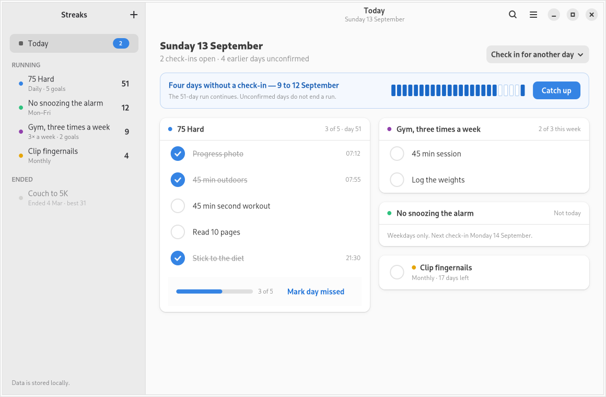
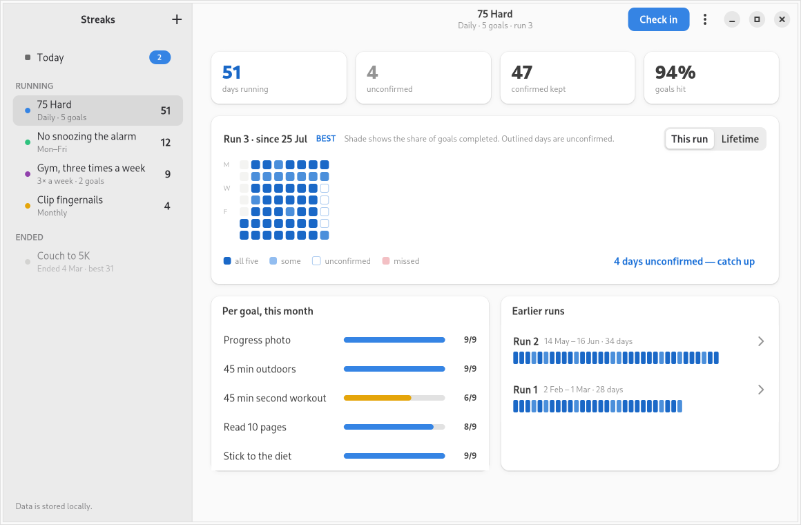
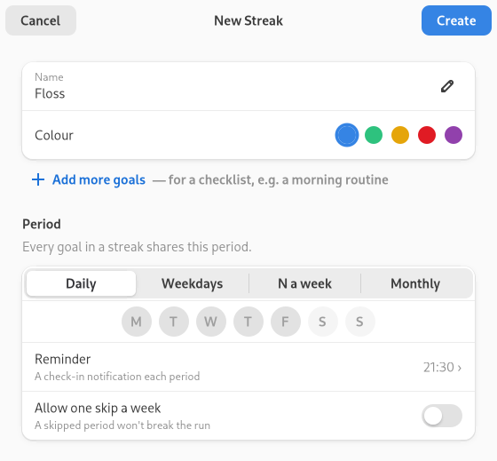
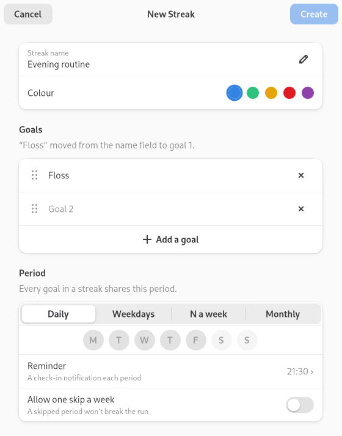
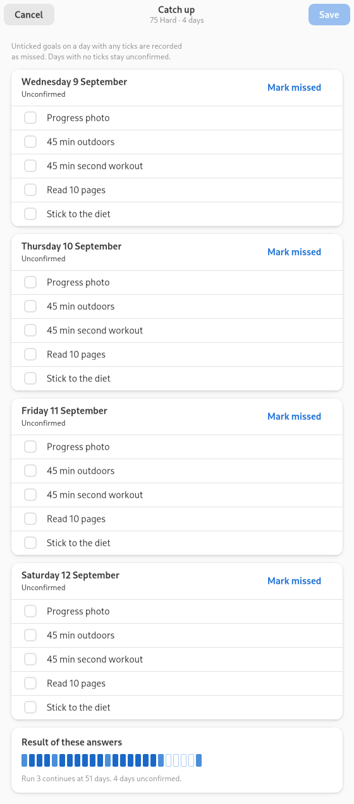
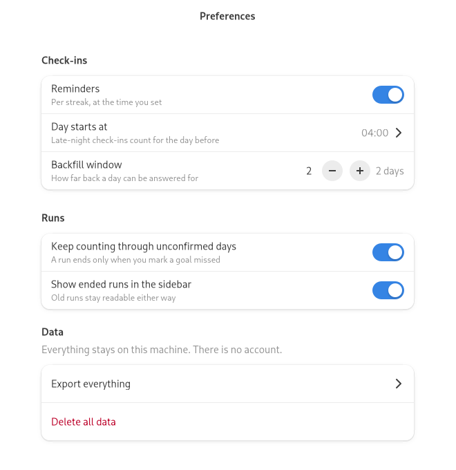
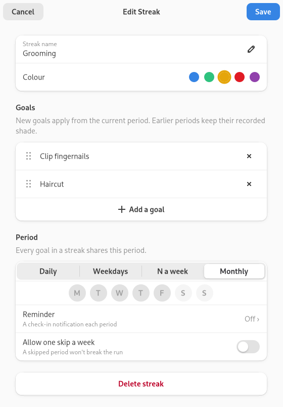
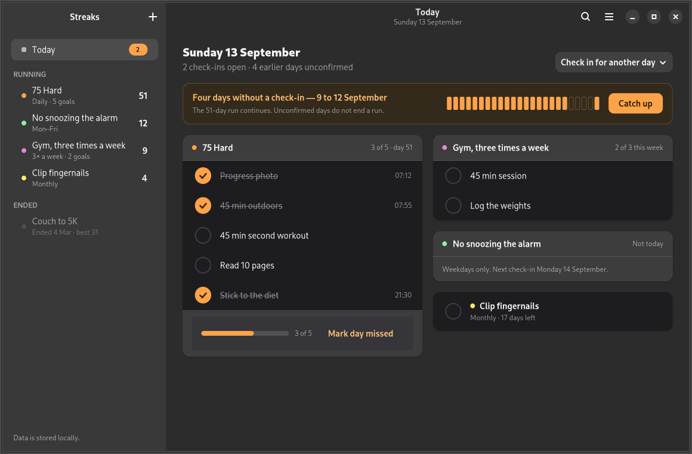
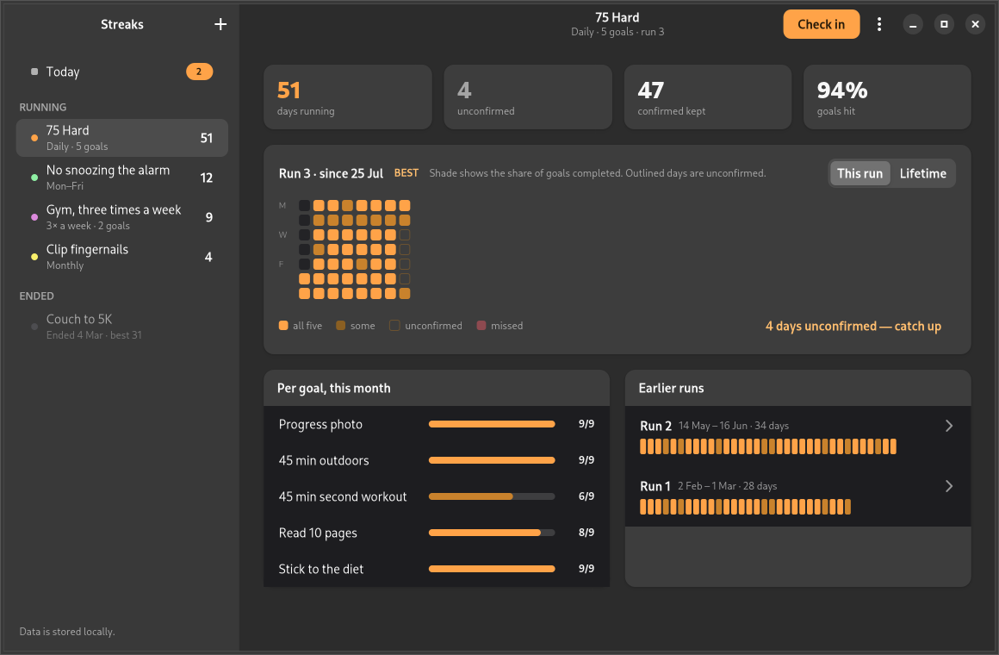

# Streaks

A native GNOME app for keeping track of things you want to do regularly — daily, weekdays,
N times a week, or monthly. It's a tracker you update by hand, not a scold or a coach: check in
when you've done the thing, mark a day missed when you haven't, and Streaks keeps the count.

Built with Python 3, GTK 4 and libadwaita, backed by a local SQLite database (Peewee ORM).
Everything stays on the machine — there is no account, no network access, and no telemetry.

## Screenshots

| | |
|---|---|
|  Today — check-in cards, quiet-days banner |  Sidebar — running/ended streaks |
|  Streak history — stats, heatmap, per-goal bars |  New/Edit streak dialog — single goal |
|  New/Edit streak dialog — "Add more goals" |  Catch-up dialog |
|  Preferences |  Editing a streak into a checklist |
|  Dark scheme — amber accent |  Dark scheme — amber chart scale |

More: [`docs/screenshots/`](docs/screenshots/) (copied from the approved golden snapshots in
`tests/snapshots/` — see `scripts/snapshots.sh`).

## Quick start

Install the toolchain (Meson, Ninja, blueprint-compiler, GTK4/Adwaita GI bindings, Peewee,
pytest, Flatpak, etc.):

```bash
scripts/bootstrap.sh --install
```

Build:

```bash
meson setup _build
meson compile -C _build
```

Run:

```bash
scripts/run.sh
# or, with the design-fixture data pre-loaded:
scripts/run.sh --seed
```

## Development

`scripts/check.sh` is the single entry point for everything CI also runs: `ruff format`/`ruff
check`, the Blueprint compile, the Meson build, the template-consistency and i18n-completeness
checks (`scripts/check_templates.py`), the Flatpak-manifest dependency check
(`scripts/check_manifest.py`), desktop-file/AppStream/GSettings-schema validation, the unit suite,
the GUI suite, and the golden-image snapshot suite.

```bash
scripts/check.sh                # everything, including snapshots
scripts/check.sh --unit         # ruff + unit tests only (fast)
scripts/check.sh --gui          # skip the standalone unit-test stage (GUI tests exercise them too)
scripts/check.sh --no-snapshots # skip the snapshot-image comparison
scripts/check.sh --fast         # unit + GUI, no snapshots, no re-render
```

GUI and snapshot tests run under Xvfb by default (`STREAKS_HEADLESS=1`, the default) so a test
window can never appear on — or hang — your real desktop. Set `STREAKS_HEADLESS=0` only if you
deliberately want to watch them run on your own display.

Under Xvfb the scripts also pin GTK to the X11 backend (`GDK_BACKEND=x11`, `WAYLAND_DISPLAY`
unset): with a Wayland socket still visible, GTK 4 prefers it and the "headless" windows would
open on the real desktop.

Other scripts:

- `scripts/screenshot.sh [screen]` — render one (or all) screens to `_build/screenshots/`
  (gitignored) for a quick look, headless by default; add `--dark` for the dark scheme.
- `scripts/snapshots.sh check` — compare the current UI against `tests/snapshots/*.png` (light)
  and `tests/snapshots/dark/*.png`.
- `scripts/snapshots.sh update` — re-render and overwrite the goldens, both schemes (only after a
  deliberate, reviewed visual change).
- `scripts/add_ui.py <name>` — scaffold a new `.blp`/`.py` component pair and wire it into
  `meson.build`, `streaks.gresource.xml` and `po/POTFILES`.

### Translations

Every user-facing string in `.blp`/`.py` is wrapped in `_()`/`ngettext()`.
`scripts/check_templates.py` (part of `scripts/check.sh`) fails the build if a `label:`/`title:`/
`subtitle:`/`tooltip-text:`/`placeholder-text:` in a `.blp`, or a matching Python keyword
argument, is ever given an untranslated literal (anything containing a letter). Regenerate the
template after adding/changing translatable strings:

```bash
meson compile -C _build streaks-pot
```

## Distribution (Flatpak)

```bash
scripts/flatpak.sh build   # flatpak-builder --user --install --force-clean
scripts/flatpak.sh run     # flatpak run com.cheerschopper.Streaks
scripts/flatpak.sh test    # deterministic, headless: bundle imports + the window actually opens
```

`scripts/flatpak.sh test` never touches a live display either: its window-open check runs under
Xvfb with the sandbox's Wayland access temporarily overridden off (`--nosocket=wayland`), so it
can't accidentally connect to a real desktop's compositor, and the app quits itself
(`STREAKS_QUIT_AFTER_STARTUP=1`) the moment the window is realised.

## Project layout

Three layers. `engine` computes every string, number and colour token from
plain data. `models` loads that data from SQLite and performs writes.
Everything else is a GTK view: it places what the engine produced into a
Blueprint template and reports user actions as signals or `models` writes
followed by `AppState.reload()`.

- `src/streaks/` — application code: `engine.py` is the pure (no GTK/DB) streak/run/history
  calculator; `models.py` is the Peewee data layer; everything else is GTK view code bound to
  `src/streaks/ui/*.blp` Blueprint templates.
- `docs/design-spec.md` — the source-of-truth UI/behaviour spec, extracted from `claude-design/`.
- `docs/engine-rules.md` — the rules the engine applies to turn check-ins into period statuses,
  runs and counts.
- `tests/unit/` — pure-Python tests against an in-memory database (no GTK).
- `tests/gui/` — PyGObject integration tests (headless by default) plus the golden-image
  snapshot suite in `tests/gui/test_snapshots.py`.

## Known gaps

- **Reminders are stored only.** A streak's reminder time round-trips through create/edit/export
  (`reminder_time` on `Streak`), but nothing schedules or delivers a notification yet — there is
  no background service, and the app doesn't need to be running for a reminder to notionally be
  "due". Wiring this up to `Gio.Notification`/a scheduled background activation is future work.
- **Narrow-window layout.** The design (and this implementation) only covers the desktop-width
  layout in `docs/design-spec.md`; there's no adaptive/narrow breakpoint for the sidebar or the
  Today two-column card grid.
- **Dark scheme.** Amber accent and chart scale via `@media (prefers-color-scheme: dark)` in
  `data/style.css` and `streaks.theme`; follows the system setting, no in-app toggle.

## License

MIT
